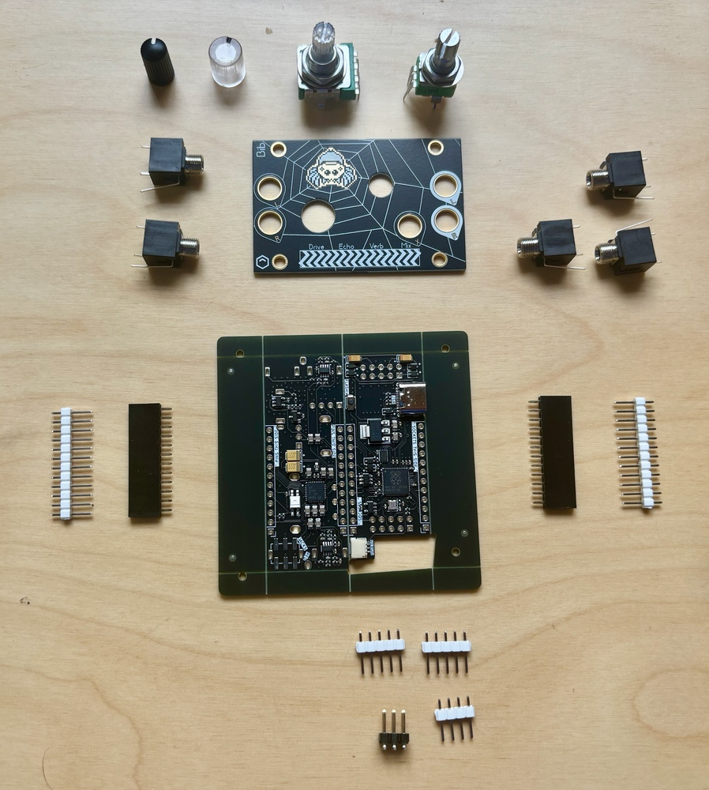
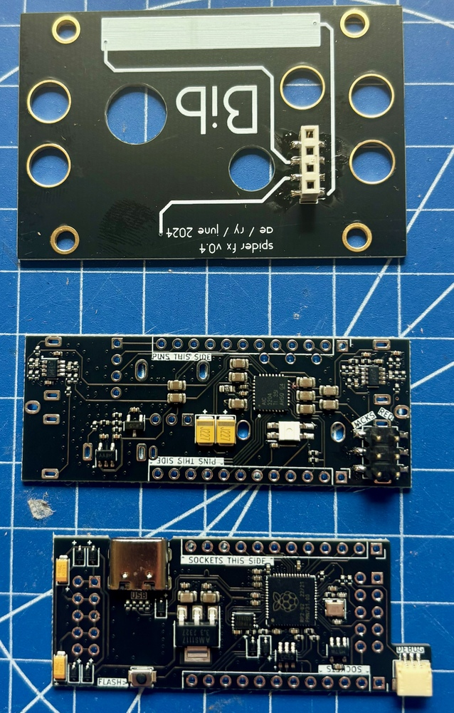
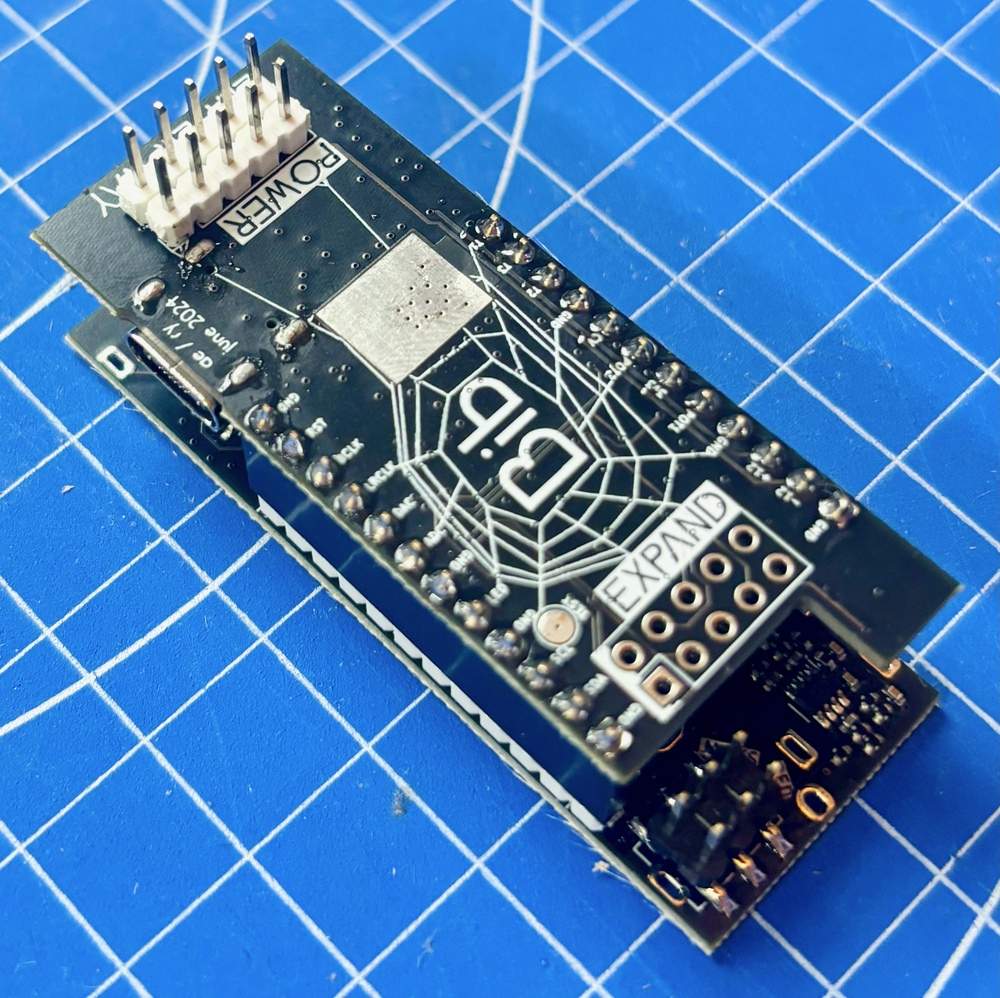
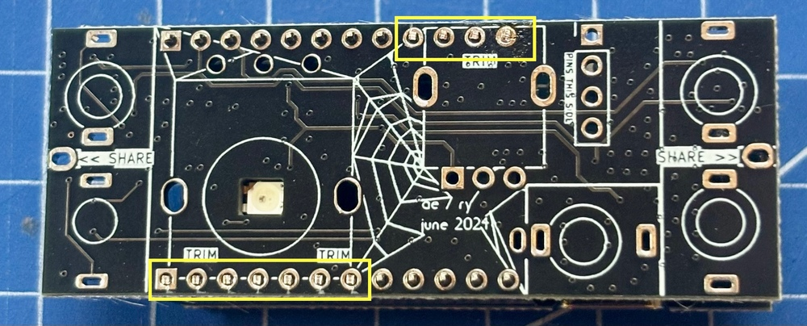
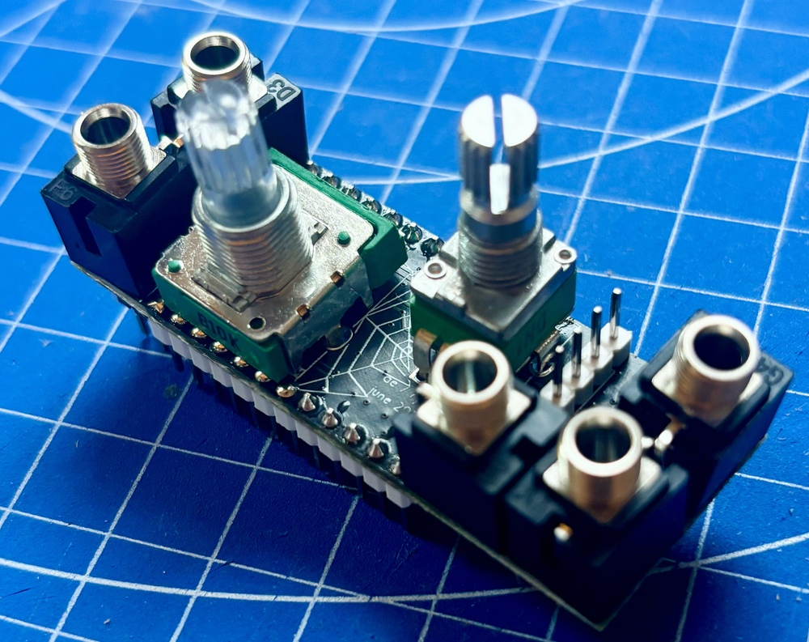
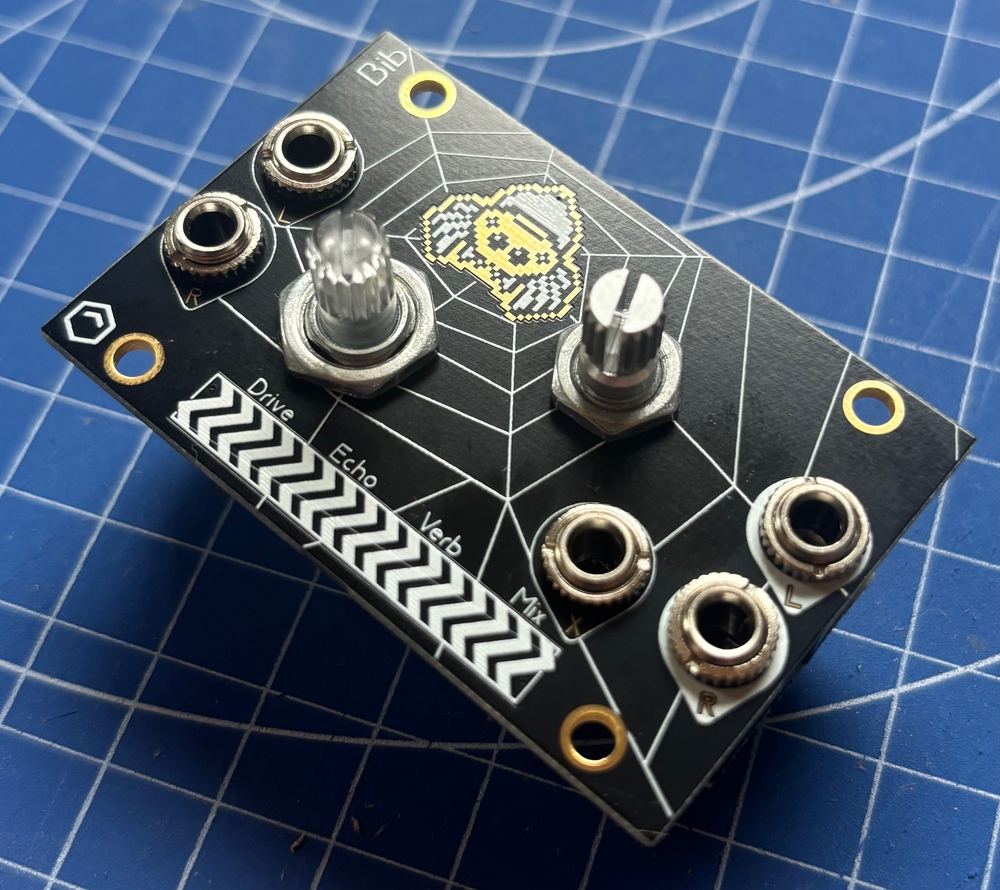
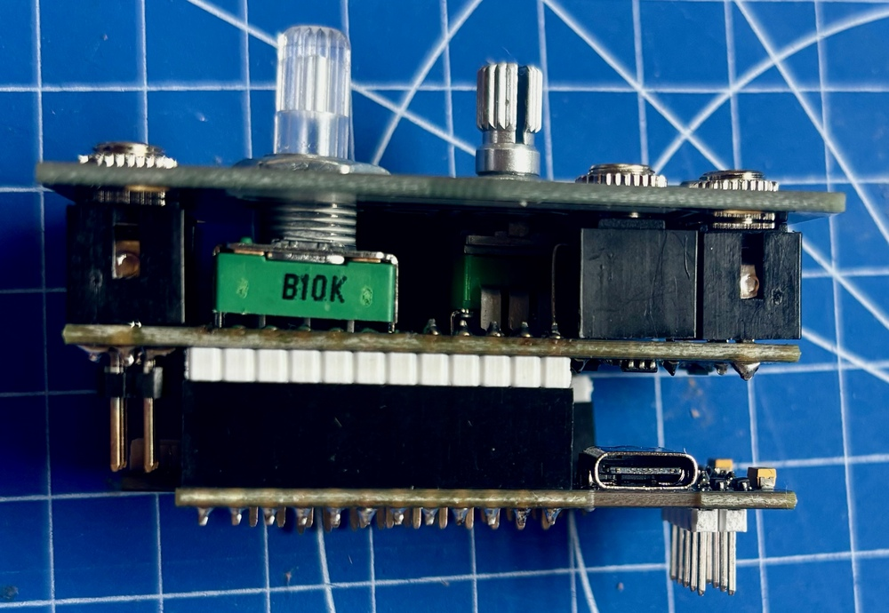

Bib - the build doc of destiny
==

Hello! Welcome to the Bib build guide.
Bib is quite a simple build, and fairly beginner friendly. 

**You will need:** a soldering iron, side cutters, a bib kit, and a little patience.

Below are most of the parts of the Bib kit, with the exception of the Eurorack power cable, mounting hardware, and for no reason other than my forgetfulness, a small 4 pin SMD socket that we will meet shortly:

### The headers - a nice warmup

Let's get the two 'SMD' headers out of the way - a small grey 4 pin socket for the front panel, and a 2x3 pin header that you can use to connect line level stereo input and headphone output to the quarter inch TRS jacks on an intellijel palette case, for example. 

Put a small pillow of solder on a *single* pin on each footprint - one on the front panel, one on the main circuit board, as hilighted in yellow below. Again - just a single pin each for now!

now line up the socket and use your iron to heat up the pollow and solder that first pin. It's worth getting the socket nice and straight, centered, and upright while only 1 pin is soldered. Don't bend it! just touch your iron to re-heat it and gently move the socket into place while the solder is melted. Once you're happy, it should look like this:

  
  
  

Now solder the remaining pins on the two connectors. Be careful on the mainboard not to disturb any of the tiny, pre-soldered components. The trick with soldering is to make sure your iron is warming both the pin to be soldered, and the pad it rests on. Heat them together for 1 or 2 seconds, then add a touch of solder. It should flow across both the pin and the pad, to make a nice soldered connection. Feel free to touch up the original 'anchor' pin on each connector.

Lastly, gently break the spare 'rails' off the edges of the main board, using a pair of pliers and gentle pressure. When separating the two halves of the main board, I use my fingers and try to avoid 'flexing' either board - there are tiny hair thin metal traces inside the fiberglass, so you don't want to flex it too much. Once you're done, you should have 3 boards: the front panel with the 4 pin socket you just soldered, an analog board with the 6 pin header, and the digital board with the USB-C port on it. Lovely!

### Preparing the pins

If your kit came with a single strip of breakable pins, break it apart now into 5, 5, 4, 12, 12 pin sections:

Connect the 12 pin pieces with the corresponding sockets, and push the 5 pin pieces into the eurorack power cable to line them up:

### Soldering the eurorack power pins

Now, with the cable still attached, put the 5x2 power pins into the back of the digital board, where it says 'POWER EITHER WAY'. Turn it over, and solder the 10 pins. Again, be careful to avoid melting or disturbing the tiny pre-soldered parts, and be sure to heat both the pad and the pin before adding solder. These pins are actually the hardest to solder in the entire project, because they are connected to lots of copper inside the board, and will 'suck up' a lot of heat. Don't be afraid to really heat them up, to allow the solder to form a nice joint. Don't just add lots of solder! If you bridge some of the central 6 pins (ie the center 2x3) that's not the end of the world, as they are all 'ground' - but it's ugly! :) It will work though. The 2 pins on each end are +12 and -12, so you dont want to bridge them to the center, lest you short out your eurorack power supply. Take your time, it'll be ok!  TODO - non blurry photo

### Making the sandwich: 12 pin headers

Ok now pop the 12 pin header+pin combos you made into both boards - we are joining them together in a kind of Bib-ish silicon sandwich. The pre-soldered components go on the inside of the sandwich, you see. Turn the board over to see the back with the Power pins you just soldered, and solder the two rows of 12 header pins, as shown below. **WE ARE ONLY SOLDERING THIS ONE SIDE! DONT JUMP AHEAD TO THE OTHER SIDE!** I tend to solder a *single* pin first, and make sure it is all nice and square and flush, before soldering the rest. That's a good trick with multipin parts in general - do one pin, line it up, then do the rest when you're happy. It's much easier to align a single pin, than it is to fix things when you've soldered 12 wonky. Ask me how I know... Oh, while you're here, maybe melt a bit of solder into the USB-C connector's holes, if they are not already full. It just adds a bit of mechanical rigidity.

OK! Flip Bib over but **DONT SOLDER THE OTHER SIDE YET**. First we need to trim the pins flush in the hilighted areas below. Use side cutters and cut them flush to the board - the pin is still inside the hole, but shouldn't poke up. PLEASE WEAR EYE PROTECTION and make sure no children/pets are near by. the little bits of metal tend to 'ping' off. Be careful.

Why trim them? It's to avoid the pins shorting out on the underside of the knobs we'll add later. 1U is cramped! Once you've trimmed them, go ahead and solder all 24 pins. Your sandwich should be nice and solid now! To prove it to yourself, feel free to gently pull it apart, setting the digital board aside for a bit.

### Trimming the pots
Ok let's prepare the pots (aka knobs)! (TODO: take non blurry photos, sorry). Both the pots have standoffs that get in the way. use sharp side cutters, wear eye protection, avoid curious pets/kids, and get rid of the little metal tabs shown in yellow below. While you're here, I tend to find the wiggly pins on the smaller pot a bit too wiggly for my taste - I flatten them very slightly with a gentle squeeze of some pliers. if you struggle to fit the pot into the board later, this'll help.

  
  

### Placing the hardware (but not soldering it) 
OK Now we're ready to put all the pots and sockets into Bib! prise the sandwich gently apart, if you didn't already, and put the digital half aside - it's finished actually! (Feel free to have a celebratory cup of tea). Freshly revitalised, **remove the nuts and washers** from the knobs, then place them along with the 5 Thonk jack sockets, and don't forget the little 4 pin header - as shown below. **DONT SOLDER ANYTHING YET!** Just plop 'em in place. The stereo pairs of thonkiconns actually share a single hole for the 'ground' pins, so it can be a bit fiddly, but you can do it! I believe in you!

Why not solder them? You'll see! Now is the exciting moment we get to place the front panel over the top of everything. The pots and thonkis should all go through the holes (did you remember to remove the pot nuts? good), perhaps after a little wiggling and persuasion (good thing you didn't solder them right!). The 4 pin header and the socket you soldered earlier should mesh together beautifully inside the sandwich. 

Take a moment to marvel at your achievement! I mean, why not loosely screw the nuts back on top of the panel to the pots and thonkis - it's really starting to look like a music thing now!

### OK, NOW you can solder the hardware
(TODO: take a picture) At this point you should solder all of the pins poking through the bottom of the board. Don't forget any! The 3 pins of the main knob, and the pins of the thonkiconn that straddle the 6 pin SMD header, are especially hidden. I'll mark them in yellow boxes once I take a photo to replace this picture of a kitten:

### Hardware Victory
My goodness! That was it! Just plug the digital board back into your freshly soldered analog board, forming a 3 level club sandwich of Bibness. Make sure you get it the right way around - as shown in the picture. If things are a little wonky, that's ok - look at mine! Wonky, but it works. That's the Bib way.

All that remains is to tighten the nuts, push the knobs onto the pot shafts, and we'll install some software!

### The Software Adventure

Use a USB-C cable (not included) to plug your computer into Bib. You do **not** need Bib to be powered from eurorack for this step. 

Bib should show up as a USB drive called `RPI-RP2` (on mac, you may find it under `/Volumes/RPI-RP2`). If it does not, try disconnecting the USB cable, holding down the *tiny* button on the digital board, just  opposite to the USB connector, while reconnecting the cable - then release the button. If it *still* doesn't show up, make sure your cable has data lines (and isn't just for charging). And if that's definitely ok - maybe check your soldering? 

Assuming the drive shows up, drag and drop the `bib_xxx.uf2` (where xxx is a version number) onto the drive. It should upload the software, and after a second, the main knob will flash white and then glow a dim red. That's a good sign! that means your Bib is working! 

If you want to fiddle right away, feel free to twist the knobs - the light should change brightness as you twist to reflect the position of the knob, and then revert to a dim glow when you release it. Pressing on the touch strip in each of the 4 zones marked `Drive`, `Echo`, `Verb`, `Mix` should cause the knob color to change Red/Green/Blue/White. If the touch is unresponsive, perhaps check your soldering - esepcially around the 4 pin socket and header on the front panel

Assuming all seems well, disconnect it from your PC, carefully connect it to your eurorack system (the power cable can be fitted either way), and -  *Happy bibbing*!
